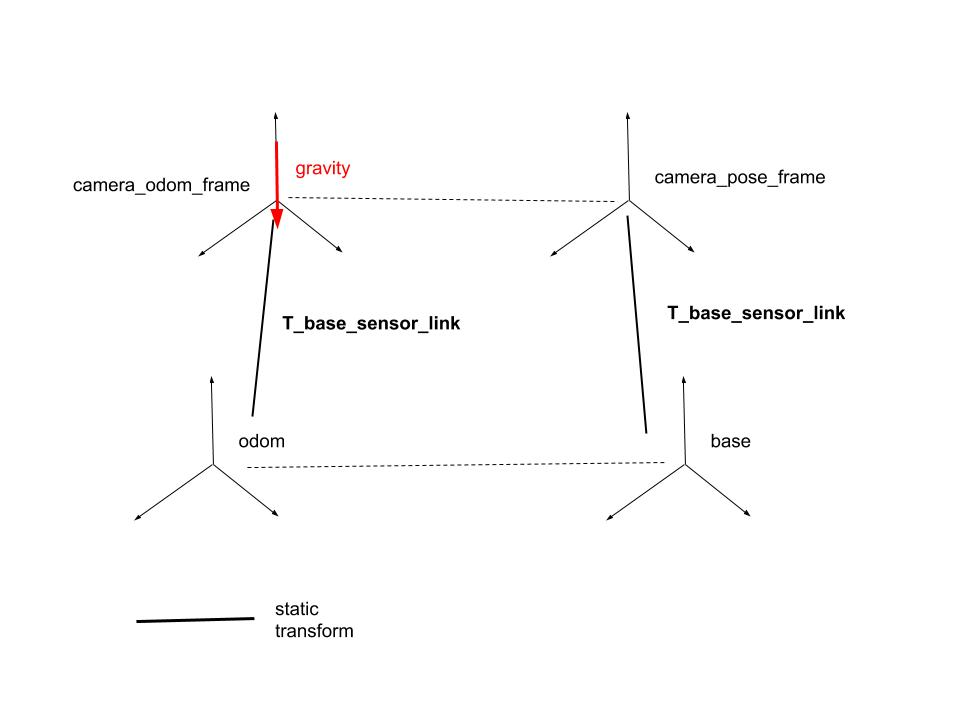

### swaco_navigation

The realsense is fused with the wheel odometry to output a estimate of the robot pose. 
The relationship between frames is depicted in the following figure:

The odometry node subscribes to the wheels encoders readings and convert them to linear velocity which is then published
under the topic `/wheel_odometry`. The realsense uses this additional input for pose estimation.

At startup, the realsense spawns a odometry frame gravity aligned. The odometry frame which we want placed in the base is exactly offset of the static transform which relates the sensor link to the base frame. In following timesteps, the transformation from the base to the odometry frame is

`T_base_odometry = T_base_sensor_link * T_camera_pose_camera_odom * (T_base_sensor_link)^-1 `

While the transform from base to sensor is static the transform from camera odom frame to the camera pose changes all the time and is updated to provide the latest transform from base to odom frame. 

The odom frame is set as a child of the base frame whose parent is the world frame. This is due to the limitation of `tf` frames which can only have one parent. 

#### Install instruction 

This package depends on the ROS wrapper of the realsense library. Install instructions are listed [here](https://drive.google.com/open?id=1-0x7pmFmAMyVSVDG87jovSSKIr_pWbtzQVOuu9rZfpo). Any useful information can be reported here or in the shared document. 